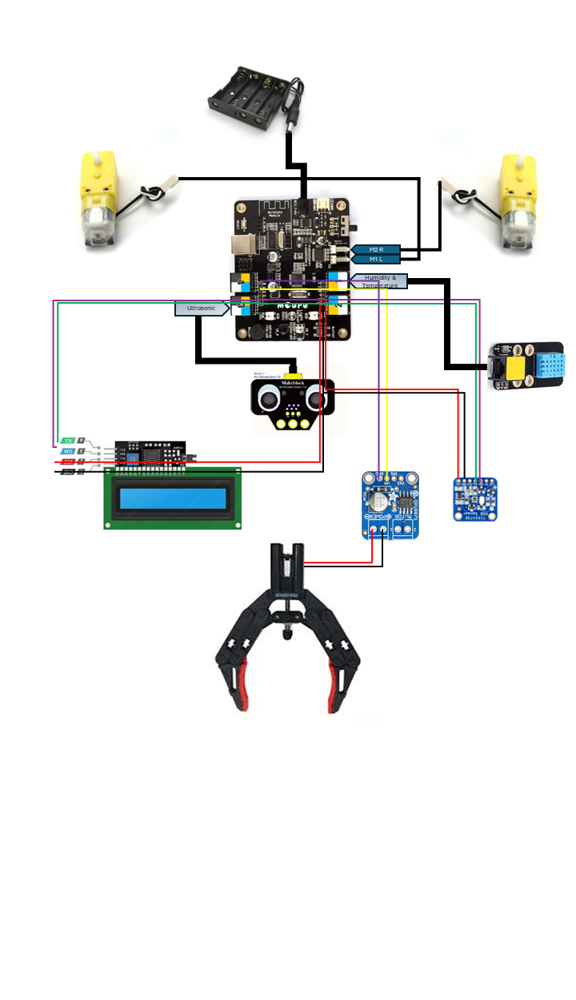

# M-bot

| | |
|-|-|
|`Author` | Galan Radu-Mihai

## Description 
- My Project consists in a robot that can grab objects and also use multiple sensors. The robot can be controlled using an IR remote
- Makeblock robot kit (Uses 2 motors a distance sensor and a humidity sensor. All the components are controlled using an IR remote)
- Makeblock clamp claw (Uses 1 motor for operating a claw)
- Adafruit DRV8871 DC Motor Driver Breakout (Used for connecting the claw's motor to the board)
- Adafruit TCS34725 RGB Color Sensor (Used for detecting the color of the ground)
- LCD (normal 2 row i2c LCD for showing information)
- Feature: it can play ImperialMarch

Connexions:
- -> RJ25_Port3 - Ultrasonic
- -> RJ25_Port1 - Humidity
- -> Motor_Interface_M1 - Right_DcMotor
- -> Motor_Interface_M2 - Left_DcMotor
- -> SCL, SDA, GND, VCC - LCD (0x27 address)
- -> SCL, SDA, GND, VCC - RGB sensor (0x29 address)
- -> A0, A1 - Motor Driver Breakout
- -> 9 - MotorBreakout_IN1
- -> 10 - MotorBreakout_IN2

## Motivation 
- Implementing a robot with different features for testing personal skills

## Architecture 

### Block diagram

<!-- Make sure the path to the picture is correct -->

### Schematic
Board Info:

#### Robot Schematic:

### Components

<!-- This is just an example, fill in with your actual components -->

| Device | Usage | Price |
|--------|--------|-------|
| Makeblock M-Bot | Robot | [39.09 USD](https://lurnbot.com/products/mbot-1-1-kit) |
| Makeblock ClampClaw | Clamp Claw | [49.34 USD](https://www.ebay.com/itm/164763774166?norover=1&mkevt=1&mkrid=711-167022-134087-1&mkcid=2&itemid=164763774166&targetid=295607582760&device=c&mktype=pla&googleloc=1011795&poi=&campaignid=20797276787&mkgroupid=155163399079&rlsatarget=pla-295607582760&abcId=&merchantid=119648210&gad_source=1&gclid=Cj0KCQjwxeyxBhC7ARIsAC7dS39oCInXtvBG4IH2cqkYi16xqXIpzWnOMBzTYvEVfe0y0GU000InjBIaAm8JEALw_wcB) |
| Adafruit TCS34725 | RGB Sensor | [7.95 USD](https://www.adafruit.com/product/1334) |
| Adafruit DRV8871  | DC Motor Driver Breakout | [7.50 USD](https://www.adafruit.com/product/3190) |
| LCD 1602  | Display | [16.34 ron](https://www.optimusdigital.ro/ro/optoelectronice-lcd-uri/2894-lcd-cu-interfata-i2c-si-backlight-albastru.html?gad_source=1&gclid=Cj0KCQjwxeyxBhC7ARIsAC7dS39htfgFEvUUoPI9yNqkE4WZvx3a_p_euAhIuBVSOkLbhWfzMVeu4oEaArfyEALw_wcB) |

### Libraries

<!-- This is just an example, fill in the table with your actual components -->

| Library | Description | Usage |
|---------|-------------|-------|
| [Makeblock Drive](https://github.com/nbourre/Makeblock-Libraries) [Refrence](https://www.arduino.cc/reference/en/libraries/makeblockdrive/) | Use to drive all devices provided by Makeblock company.This library allows an Arduino board to control all devices provided by Makeblock company. | Used for commanding the 2 motors and the Ultrasonic and Humidity sensors  |
| [Wire](https://github.com/arduino/ArduinoCore-avr/blob/master/libraries/Wire/src/Wire.h) [Refrence](https://www.arduino.cc/reference/en/libraries/makeblockdrive/) | This library allows you to communicate with I2C devices, a feature that is present on all Arduino boards. I2C is a very common protocol, primarly used for reading/sending data to/from external I2C components.  | Used for handeling the connection with the 2 I2C devices  |
| [SoftwareSerial](https://github.com/arduino/ArduinoCore-avr/blob/master/libraries/SoftwareSerial/src/SoftwareSerial.h) [Refrence](https://docs.arduino.cc/learn/built-in-libraries/software-serial/) | The SoftwareSerial library allows serial communication on other digital pins of an Arduino board, using software to replicate the functionality (hence the name "SoftwareSerial").  | Used for enabeling the serial ports |
| [LiquidCrystal](https://github.com/arduino-libraries/LiquidCrystal) [Refrene](https://www.arduino.cc/reference/en/libraries/liquidcrystal-i2c/) | This library allows an Arduino/Genuino board to control LiquidCrystal displays (LCDs) based on the Hitachi HD44780 (or a compatible) chipset, which is found on most text-based LCDs. The library works with in either 4 or 8 bit mode (i.e. using 4 or 8 data lines in addition to the rs, enable, and, optionally, the rw control lines). |  Used for controlling the LCD |
| [TimerFreeTone](https://bitbucket.org/teckel12/arduino-timer-free-tone/downloads/) [Refrene](https://forum.arduino.cc/t/timerfreetone-library-v1-5-play-tones-without-timers-and-therefore-no-conflicts/229448) | Play tones without timers and therefore no conflicts |  Used for contolling the buzzer without creating a conflict between tone() and the IR library |

## Log

<!-- write every week your progress here -->

### Week 6 - 12 May

### Week 7 - 19 May

### Week 20 - 26 May

## Reference links

<!-- Fill in with appropriate links and link titles -->

[Claw - PRESENTATION](https://www.youtube.com/watch?app=desktop&v=9xSvRSg7VZA)

[LCD - TUTORIAL](https://www.youtube.com/watch?v=s_-nIgo71_w)

[MotorBreakout-DRV8871 - PRESENTATION](https://learn.adafruit.com/adafruit-drv8871-brushed-dc-motor-driver-breakout/overview) ///
[MotorBreakout-DRV8871 - TUTORIAL](https://www.youtube.com/watch?v=9Ye1HgJaeVI&t=40s)

[RGB Sensor-TCS34725 - PRESENTATION](https://learn.adafruit.com/adafruit-drv8871-brushed-dc-motor-driver-breakout/overview) ///
[RGB Sensor-TCS34725 - TUTORIAL](https://www.youtube.com/watch?v=dCnjwxkWZ-w&t=3s)

[MbotKit - OFFICIAL SITE](https://www.makeblock.com/pages/mbot-robot-kit) ///
[MbotKit - PRESENTATION](https://www.youtube.com/watch?v=ZNcebanW_pQ)

[Makeblock_mCore_Board - INFO](https://support.makeblock.com/hc/en-us/articles/4412894402967-mCore-Main-Control-Board-of-mBot) /// 
[Makeblock_MeUltrasonic - INFO](https://education.makeblock.com/help/me-ultrasonic-sensor/) /// 
[Makeblock_IRremote - INFO](https://education.makeblock.com/help/cyberpi-series-ir-remote-control/)

