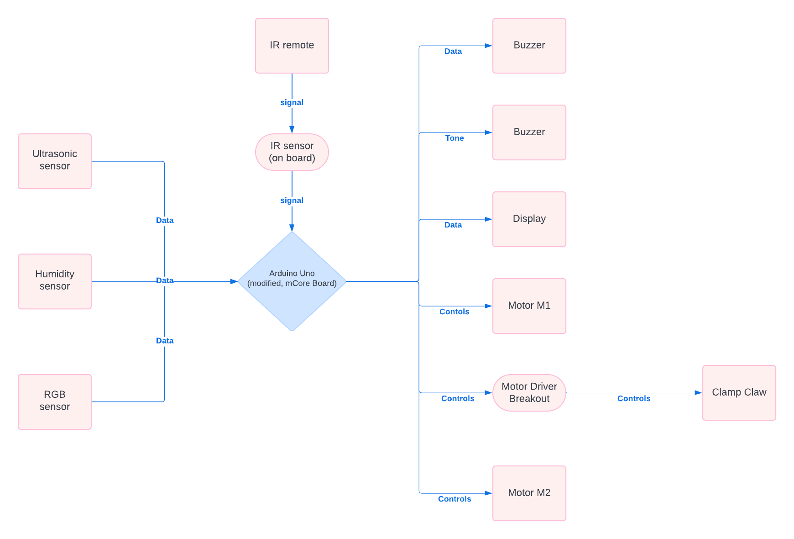

# M-bot

| | |
|-|-|
|`Author` | Galan Radu Mihai

## Description 
- My Project consists in a robot that can grab objects and also use multiple sensors
- Makeblock robot kit (Uses 2 motors and a distance sensor)
- Makeblock clamp claw (Uses 1 motor fow actionating a claw)
- LCD (normal 2 row i2c LCD for showing information)

## Motivation 
- Implementing a robot with different features features

## Architecture 

### Block diagram

<!-- Make sure the path to the picture is correct -->

### Schematic

### Components

<!-- This is just an example, fill in with your actual components -->

| Device | Usage | Price |
|--------|--------|-------|
| Makeblock M-Bot | Robot | [39.09 USD](https://lurnbot.com/products/mbot-1-1-kit) |
| Makeblock ClampClaw | Clamp Claw | [49.34 USD](https://www.ebay.com/itm/164763774166?norover=1&mkevt=1&mkrid=711-167022-134087-1&mkcid=2&itemid=164763774166&targetid=295607582760&device=c&mktype=pla&googleloc=1011795&poi=&campaignid=20797276787&mkgroupid=155163399079&rlsatarget=pla-295607582760&abcId=&merchantid=119648210&gad_source=1&gclid=Cj0KCQjwxeyxBhC7ARIsAC7dS39oCInXtvBG4IH2cqkYi16xqXIpzWnOMBzTYvEVfe0y0GU000InjBIaAm8JEALw_wcB) |
| Adafruit TCS34725 | RGB Sensor | [7.95 USD](https://www.adafruit.com/product/1334) |
| Adafruit DRV8871  | DC Motor Driver Breakout | [7.50 USD](https://www.adafruit.com/product/3190) |
| LCD 1602  | Display | [16.34 ron](https://www.optimusdigital.ro/ro/optoelectronice-lcd-uri/2894-lcd-cu-interfata-i2c-si-backlight-albastru.html?gad_source=1&gclid=Cj0KCQjwxeyxBhC7ARIsAC7dS39htfgFEvUUoPI9yNqkE4WZvx3a_p_euAhIuBVSOkLbhWfzMVeu4oEaArfyEALw_wcB) |

### Libraries

<!-- This is just an example, fill in the table with your actual components -->

| Library | Description | Usage |
|---------|-------------|-------|
| [Makeblock Drive]([link-to-lib](https://github.com/nbourre/Makeblock-Libraries)) | Use to drive all devices provided by Makeblock company.This library allows an Arduino board to control all devices provided by Makeblock company. | Used for commanding the 2 motors and the Ultrasonic and Humidity sensors  |

## Log

<!-- write every week your progress here -->

### Week 6 - 12 May

### Week 7 - 19 May

### Week 20 - 26 May

## Reference links

<!-- Fill in with appropriate links and link titles -->

[Claw - PRESENTATION](https://www.youtube.com/watch?app=desktop&v=9xSvRSg7VZA)

[LCD - TUTORIAL](https://www.youtube.com/watch?v=s_-nIgo71_w)

[MotorBreakout-DRV8871 - PRESENTATION](https://learn.adafruit.com/adafruit-drv8871-brushed-dc-motor-driver-breakout/overview) ///
[MotorBreakout-DRV8871 - TUTORIAL](https://www.youtube.com/watch?v=9Ye1HgJaeVI&t=40s)

[MbotKit - PRESENTATION](https://www.youtube.com/watch?v=ZNcebanW_pQ)

